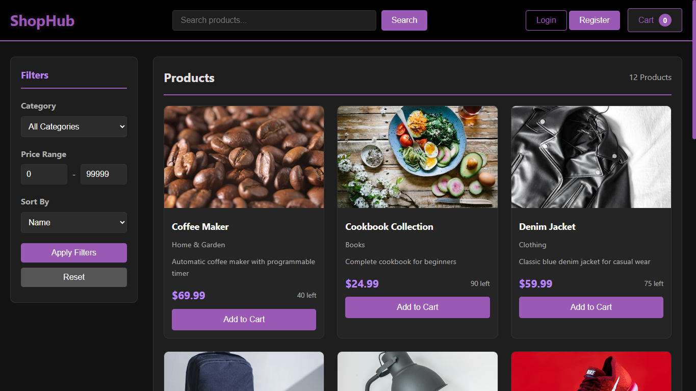

# 🚀 Web Development Journey

Welcome to my central repository for Web Development projects. Here, I document our journey in building full-stack applications, solving algorithmic problems, and mastering core technologies from scratch.


*(Note: Ensure you have the banner image named banner.jpg in the same folder)*

---

## 📂 Featured Projects

### 1️⃣ ShopHub - Native PHP E-commerce
**Directory:** `./1-ShopHub-Native`

ShopHub is a fully functional E-commerce system built entirely with **Native PHP (No Frameworks)** to demonstrate a deep understanding of core web technologies, session management, and database interactions.

#### 🛠️ Tech Stack
* **Backend:** PHP (Native/Core), MySQL
* **Frontend:** HTML5, CSS3, JavaScript (Vanilla)
* **Database:** Relational Schema (Users, Products, Categories, Orders)

#### ✨ Key Features
* **Authentication:** Secure Login/Registration system with hashed passwords.
* **Role-Based Access:**
    * **User:** Browse products, add to cart, checkout.
    * **Admin:** Dashboard to manage products (CRUD operations) and view orders.
* **Shopping Cart:** Session-based cart system with real-time updates.
* **Checkout System:** Order processing and stock management logic.
* **Security:** Input sanitization (to prevent SQL Injection) and XSS protection.

#### 📸 Screenshots



---

## ⚙️ How to Run Locally

1.  **Clone the repository:**
    ```bash
    git clone [https://github.com/Mahmo7dShaker/Web-Development.git](https://github.com/Mahmo7dShaker/Web-Development.git)
    ```
2.  **Database Setup:**
    * Open `phpMyAdmin`.
    * Create a new database named `ecommerce_store`.
    * Import the `database/database.sql` file located inside the project folder.
3.  **Configuration:**
    * Rename `config.example.php` (if available) to `config.php`.
    * Update database credentials if necessary.
4.  **Launch:**
    * Start your local server (Apache/XAMPP).
    * Navigate to `http://localhost/Web-Development/1-ShopHub-Native`.

---

## 👥 Team Members

This project was collaboratively developed by:

* **Mahmoud Wajih**
* **Abdullah Adel Ali**
* **Mohamed Meshref**
* **Omar Ahmed Zaki**

---
*⭐ If you like this project, please give the repo a star!*